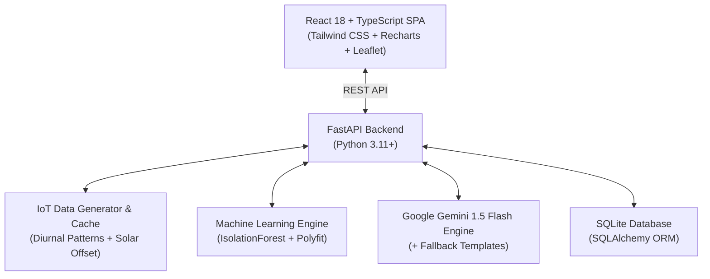

# 🌐 EcoNexus Intelligence

> **AI-Powered Decision-Support Platform for Smarter, Safer & Sustainable Facilities**

[](https://fastapi.tiangolo.com)
[](https://reactjs.org/)
[](https://www.typescriptlang.org/)
[](https://tailwindcss.com/)
[](https://aistudio.google.com/)

---

## 📖 Overview

**EcoNexus Intelligence** is a decision-support platform designed for modern university campuses, hospitals, commercial complexes, and industrial estates.

It continuously ingests multi-domain telemetry from IoT sensors (energy meters, water flow transmitters, smart waste bins, air quality monitors, traffic cameras, and safety logs), executes machine learning algorithms (`IsolationForest`, Z-Score, regression forecasting), and leverages Google's **Gemini AI** to deliver actionable operational intelligence.

Every card and dashboard element is designed to answer six fundamental operational questions in real time:
1. **What is happening?**
2. **What is the biggest risk?**
3. **Why is it happening?**
4. **What will happen next?**
5. **What should we do?**
6. **What expected impact will that action have?**

---

## ✨ Features

- **⚡ Energy Intelligence**: Diurnal load curves, peak demand tracking, solar PV generation offset, building load comparisons, Time-of-Day (TOD) electricity tariff calculations in ₹.
- **💧 Water Intelligence**: Pressure monitoring, overnight leakage detection baseline, zone consumption breakdowns.
- **♻️ Waste Intelligence**: Smart bin fill level tracking, overflow risk prediction (>75%), collection route efficiency metrics.
- **🌬️ Air Quality Monitoring**: AQI calculation, PM2.5 / PM10 / CO₂ / Temperature / Humidity telemetry, spatial hotspot GIS mapping.
- **🚗 Traffic & Parking**: Congestion level detection, peak hour timing, gate queues, parking zone fill percentages.
- **🛡️ Safety & Asset Intelligence**: Incident logging, equipment utilization tracking, underutilized equipment alerts.
- **🧠 AI Facility Copilot**: Interactive conversational assistant powered by Google Gemini with preset operational suggestion prompts.
- **🎛️ Scenario Simulator**: Interactive parameter adjustment (HVAC output, water usage, waste frequency, traffic, campus occupancy) with instant AI impact modeling.
- **📋 Action Center**: Prioritized AI recommendations with lifecycle status tracking (`new`, `in_progress`, `completed`).
- **📁 CSV Data Ingestion**: Drag-and-drop CSV parser with auto-detected column mappings and summary statistical analysis.

---

## 🏗️ Architecture



---

## 🚀 Quick Start (Local Setup)

### 1. Clone the Repository
```bash
git clone https://github.com/your-username/econexus-intelligence.git
cd econexus-intelligence
```

### 2. Configure Environment Variables
Copy `.env.example` to `.env` and fill in your keys:
```bash
cp .env.example .env
```
Edit `.env`:
```ini
GEMINI_API_KEY=your_gemini_api_key_here
MAP_API_KEY=your_google_maps_key_here
```

### 3. Start the Backend
```bash
python -m venv venv
# Windows:
.\venv\Scripts\activate
# Linux/macOS:
source venv/bin/activate

pip install -r backend/requirements.txt
uvicorn backend.main:app --host 127.0.0.1 --port 8000 --reload
```
*Backend runs at: `http://localhost:8000` (API documentation at `/docs`)*

### 4. Start the Frontend
```bash
cd frontend
npm install
npm run dev
```
*Frontend runs at: `http://localhost:5173`*

---

## ☁️ Deployment Guide

### Deploying Backend to Render.com
1. Create a new **Web Service** on [Render](https://render.com).
2. Connect your GitHub repository.
3. Configure the service:
   - **Environment**: `Python`
   - **Build Command**: `pip install -r backend/requirements.txt`
   - **Start Command**: `uvicorn backend.main:app --host 0.0.0.0 --port $PORT`
4. In **Environment Variables**, add:
   - `PYTHONPATH`: `.`
   - `GEMINI_API_KEY`: *(your Gemini key)*
   - `MAP_API_KEY`: *(your Google Maps key)*
   - `DATABASE_URL`: `sqlite:///./econexus.db`

### Deploying Frontend to Vercel
1. Import your repository into [Vercel](https://vercel.com).
2. Configure project settings:
   - **Root Directory**: `frontend`
   - **Framework Preset**: `Vite`
   - **Build Command**: `npm run build`
   - **Output Directory**: `dist`
3. In **Environment Variables**, add:
   - `VITE_API_BASE_URL`: `https://your-render-backend-url.onrender.com/api`
4. Click **Deploy**.

---

## 📄 License
MIT License. Built for sustainability and facility intelligence.
